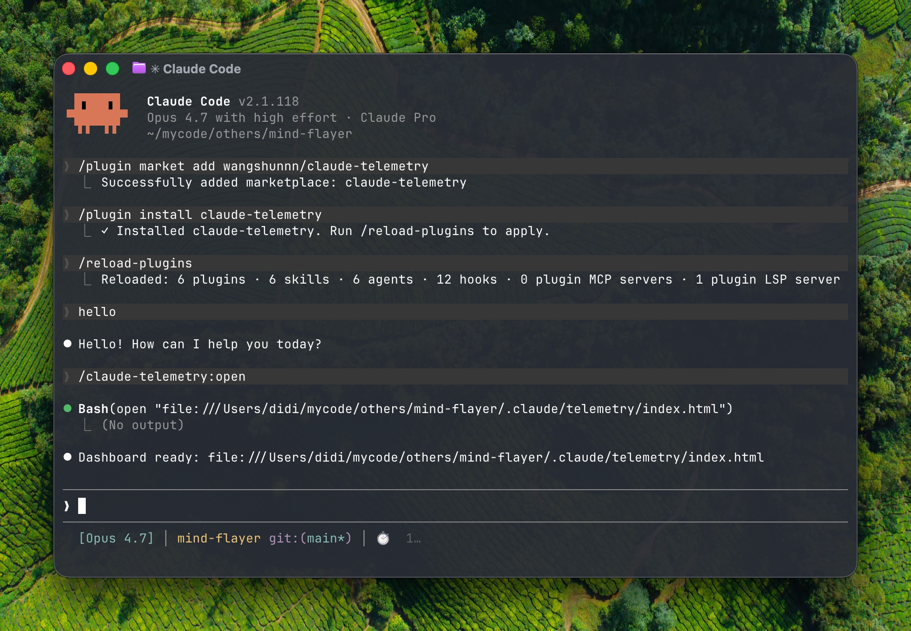

# claude-telemetry

[简体中文](./README.zh-CN.md)

Offline telemetry and a self-contained dashboard for Claude Code. It helps you see which docs, rules, skills, and agent instructions are actually used in each turn.

## Install

Add the marketplace once:

```bash
/plugin marketplace add wangshunnn/claude-telemetry
```

Then install the plugin:

```bash
/plugin install claude-telemetry
```

After that, reload plugins:

```bash
/reload-plugins
```

<details>
<summary>If installation hits a same-name plugin conflict</summary>

Use the explicit source:

```bash
/plugin install claude-telemetry@claude-telemetry
```

</details>

## Use

Use Claude in your project for a few turns, then run:

```bash
/claude-telemetry:open
```

This builds the current project's offline dashboard and opens it in your browser.

## Update

```bash
/plugin marketplace update claude-telemetry
/plugin update claude-telemetry
/reload-plugins
```

## Screenshot



## How It Works

```text
[Claude Code session] --hooks--> [claude-telemetry plugin: append-event / on-stop] --> [local events.jsonl] --/claude-telemetry:open--> [build.mjs -> snapshot.json + index.html] --> [offline dashboard]
```

For local integration and implementation details, see [DEVELOPMENT.md](./DEVELOPMENT.md).

## What You Get

- Per-turn knowledge hit rate for docs, rules, skills, and instruction files
- Tool usage, permission requests, idle prompts, tokens, and API cost
- Local-only storage under `~/.claude/claude-telemetry/`
- Self-contained `index.html` and `snapshot.json`

## Notes

- Telemetry can include raw prompts, absolute file paths, and permission command inputs.
- Output is written outside your repo by default.
- Release notes live in [CHANGELOG.md](./CHANGELOG.md).

## License

MIT — [LICENSE](./LICENSE)
