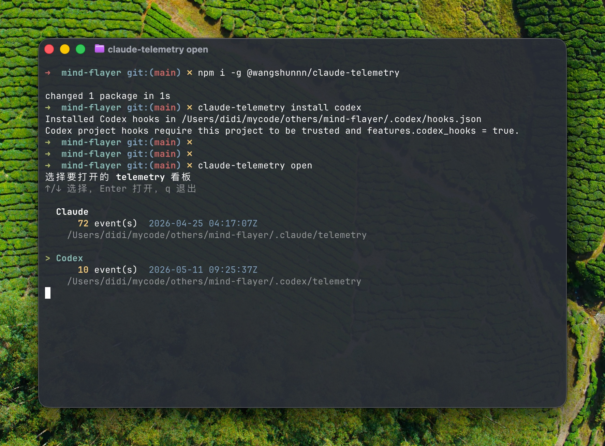
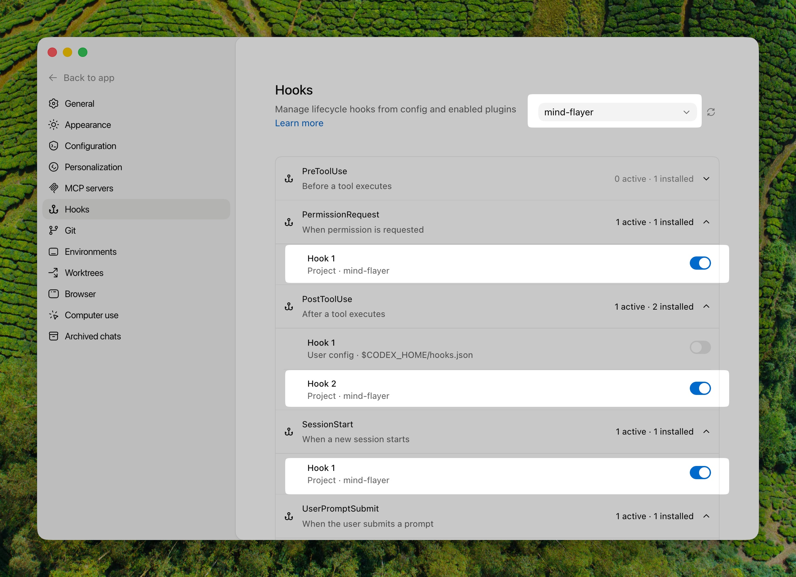

# claude-telemetry

[English](./README.md)

给 Claude Code 和 Codex 用的本地离线遥测插件、CLI 和自包含仪表盘。它可以帮助你看清每一轮里，哪些文档、规则、技能和 agent 指令真的被读到了。

## 目录

- [Claude Code](#claude-code-plugin)
- [Codex](#codex-platform)

## Claude Code 插件

通过 Claude Code marketplace 安装插件。

```bash
/plugin market add wangshunnn/claude-telemetry
/plugin install claude-telemetry
/reload-plugins
```

安装后，遥测会从新的对话开始采集。先在项目里正常使用 Claude 几轮，再打开看板：

```bash
/claude-telemetry:open
```

这个命令会为当前项目生成离线仪表盘，并自动在浏览器中打开。

建议把 `.claude/telemetry/` 加进被观测项目自己的 `.gitignore`。

<details>
<summary>如果安装时遇到同名插件冲突</summary>

请使用带来源的写法。当前 market 名也叫 `claude-telemetry`，所以显式安装命令会写成：

```bash
/plugin install claude-telemetry@claude-telemetry
```

</details>

### 更新

更新 Claude Code 插件：

```bash
/plugin market update claude-telemetry
/plugin update claude-telemetry
/reload-plugins
```

### 截图


## Codex 平台

如果你要观测 Codex，请使用 npm 包安装 CLI，并给当前项目安装 Codex hooks。

```bash
npm i -g @wangshunnn/claude-telemetry
cd /path/to/your/project
claude-telemetry install codex
```

然后在这个已信任项目里正常使用 Codex 几轮，再打开 Codex 看板：

```bash
claude-telemetry open codex
```

Codex 项目级 hooks 需要同时满足两个 Codex 侧前提：

- 当前项目已被 Codex trust。
- Codex 配置里启用了 `features.codex_hooks = true`。

例如 `~/.codex/config.toml`：

```toml
[features]
codex_hooks = true
```

常用 Codex 命令：

```bash
claude-telemetry open           # 同时有 Codex/Claude 数据时交互式选择
claude-telemetry open codex     # 打开 Codex 遥测看板
claude-telemetry doctor codex   # 检查 hooks、trust、配置、PATH 和数据
claude-telemetry uninstall codex
```

Codex 日志会单独写入 `.codex/telemetry/`。建议把它加进被观测项目自己的 `.gitignore`：

```bash
.codex/telemetry/
```

### 截图




## 你会看到什么

- 每轮对 docs、rules、skills、instruction 文件的命中情况
- 工具使用、权限申请、idle prompt、token 用量和上下文规模
- Claude Code 数据保存在当前项目的 `.claude/telemetry/`，Codex 数据保存在 `.codex/telemetry/`
- 生成自包含的 `index.html` 和 `snapshot.json`

## 说明

- 遥测内容可能包含原始 prompt、绝对路径和权限命令输入。
- 输出默认写在当前项目里，这样 Claude Code 执行插件命令时不会越出工作区写入边界。
- 只有在你明确想把多个项目的遥测集中到同一个目录时，才需要设置 `CLAUDE_TELEMETRY_ROOT`。
- npm 包会发布 `claude-telemetry` CLI，以及 Claude Code marketplace 安装路径需要的插件文件。
- 发布记录见 [CHANGELOG.md](./CHANGELOG.md)。

## License

MIT — [LICENSE](./LICENSE)
