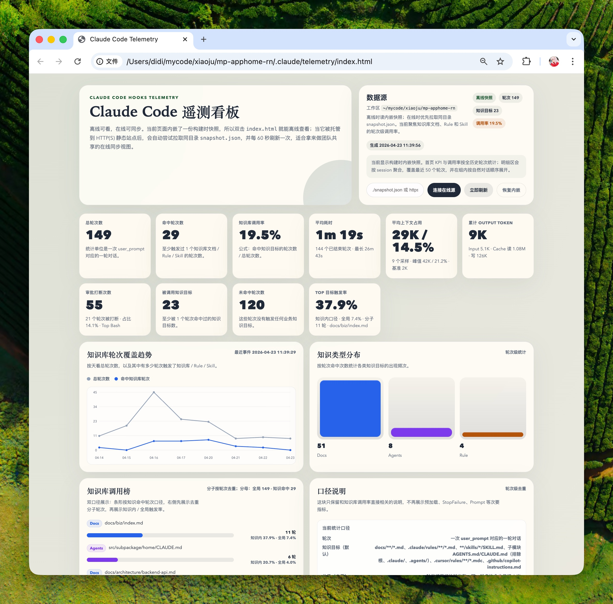

# claude-telemetry

[English](./README.md)

给 Claude Code 用的本地离线遥测插件和自包含仪表盘。它可以帮助你看清每一轮里，哪些文档、规则、技能和 agent 指令真的被读到了。

## 安装

先添加 marketplace：

```bash
/plugin market add wangshunnn/claude-telemetry
```

再安装插件：

```bash
/plugin install claude-telemetry
```

然后重载一下插件：

```bash
/reload-plugins
```

<details>
<summary>如果安装时遇到同名插件冲突</summary>

请使用带来源的写法。当前 market 名也叫 `claude-telemetry`，所以显式安装命令会写成：

```bash
/plugin install claude-telemetry@claude-telemetry
```

</details>

## 使用

安装后，遥测会从新的对话开始采集。先在项目里正常使用 Claude 几轮，再打开看板：

```bash
/claude-telemetry:open
```

这个命令会为当前项目生成离线仪表盘，并自动在浏览器中打开。

建议把 `.claude/telemetry/` 加进被观测项目自己的 `.gitignore`。

## 更新

```bash
/plugin market update claude-telemetry
/plugin update claude-telemetry
/reload-plugins
```

## 截图




## 工作原理

```text
[Claude Code 会话] --hooks--> [claude-telemetry 插件: append-event / on-stop] --> [本地 events.jsonl] --/claude-telemetry:open--> [build.mjs -> snapshot.json + index.html] --> [离线仪表盘]
```

本地接入和实现细节见 [DEVELOPMENT.zh-CN.md](./DEVELOPMENT.zh-CN.md)。

## 你会看到什么

- 每轮对 docs、rules、skills、instruction 文件的命中情况
- 工具使用、权限申请、idle prompt、tokens 和 API cost
- 数据默认保存在当前项目的 `.claude/telemetry/`
- 生成自包含的 `index.html` 和 `snapshot.json`

## 说明

- 遥测内容可能包含原始 prompt、绝对路径和权限命令输入。
- 输出默认写在当前项目里，这样 Claude Code 执行插件命令时不会越出工作区写入边界。
- 只有在你明确想把多个项目的遥测集中到同一个目录时，才需要设置 `CLAUDE_TELEMETRY_ROOT`。
- 发布记录见 [CHANGELOG.md](./CHANGELOG.md)。

## License

MIT — [LICENSE](./LICENSE)
